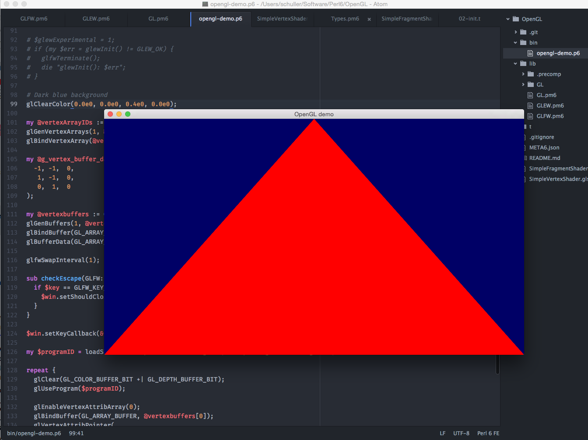

OpenGL
======

Bindings to the OpenGL library so you can write graphics programs in perl6.

Only tested on a Mac running Yosemite.

Dependencies: glfw3 (`brew install glfw3` on Mac)

Running:

    perl6 -Ilib bin/opengl-demo.p6

Installing (eventually, you're better off using this project for now because you'll want to add more routines):

    panda install .

Screenshot:

